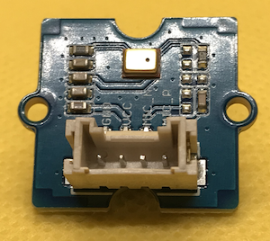

# Micro:bit - Grove Examples

## Introduction

This repository contains examples Micropython programs demonstrating how to use various Grove components with the BBC Micro:bit microcontroller.

## Grove Components

The library covers the following Grove components

| Component                                                  |                                                                       | SeeedStudio                                                                                                         | Example                                       |
| ---------------------------------------------------------- | --------------------------------------------------------------------- | ------------------------------------------------------------------------------------------------------------------- | --------------------------------------------- |
| OLED Display 0.66" (SSD1306)                               |                                  | [Go Here](https://www.seeedstudio.com/Grove-OLED-Display-0-66-SSD1306-v1-0-p-5096.html)                             | [Go Here](src/oled-ssd1306.py)                |
| OLED Yellow&Blue Display 0.96 (SSD1315)                    |                                  | [Go Here](https://www.seeedstudio.com/Grove-OLED-Yellow-Blue-Display-0-96-SSD1315-V1-0-p-5010.html)                 | [Go Here](src/oled-ssd1315.py)                | 
| Ultrasonic Distance Sensor                                 |     | [Go Here](https://www.seeedstudio.com/Grove-Ultrasonic-Distance-Sensor.html)                                        | [Go Here](src/ultrasonic-ranger.py)           |
| Buzzer                                                     |                                              | [Go Here](https://www.seeedstudio.com/Grove-Buzzer.html)                                                            | [Go Here](src/buzzer.py)                      |
| Passive Buzzer                                             |                              | [Go Here](https://www.seeedstudio.com/Grove-Passive-Buzzer-p-4525.html)                                             | [Go Here](src/buzzer.py)                      |
| LED (Blue, Red, Green, White)                              |                                                    | [Go Here](https://www.seeedstudio.com/Grove-LED-Pack-p-4364.html)                                                   | [Go Here](src/led.py)                         |
| Magnetic Switch                                            |                            | [Go Here](https://www.seeedstudio.com/Grove-Magnetic-Switch.html)                                                   | [Go Here](src/magnetic-switch.py)             |
| Tilt Switch                                                |                                    | [Go Here](https://www.seeedstudio.com/Grove-Tilt-Switch.html)                                                       | [Go Here](src/tilt-switch.py)                 |
| Relay                                                      |                                                | [Go Here](https://www.seeedstudio.com/Grove-Relay.html)                                                             | [Go Here](src/relay.py)                       |
| Temperature Sensor                                         |                                    | [Go Here](https://www.seeedstudio.com/Grove-Temperature-Sensor.html)                                                | [Go Here](src/temp-sensor.py)                 |
| AHT20 I2C Industrial Grade Temperature and Humidity Sensor |                                                | [Go Here](https://www.seeedstudio.com/Grove-AHT20-I2C-Industrial-grade-temperature-and-humidity-sensor-p-4497.html) | [Go Here](src/aht.py)                         |
| Temperature & Humidity Sensor V2.0 (DHT20)                 |                             | [Go Here](https://www.seeedstudio.com/Grove-Temperature-Humidity-Sensor-V2-0-DHT20-p-4967.html)                     | [Go Here](src/dht20-temperature-sensor.py)    |
| Vibration Motor                                            |                            | [Go Here](https://www.seeedstudio.com/Grove-Vibration-Motor.html)                                                   | [Go Here](src/vibration-motor.py)             |
| Thumb Joystick                                             |                              | [Go Here](https://www.seeedstudio.com/Grove-Thumb-Joystick.html)                                                    | [Go Here](src/thumb-joystick.py)              |
| Soil Moisture Sensor                                       |                            | [Go Here](https://www.seeedstudio.com/Grove-Moisture-Sensor.html)                                                   | [Go Here](src/moisture-sensor.py)             |
| Slide Potentiometer                                        |                  | [Go Here](https://www.seeedstudio.com/Grove-Slide-Potentiometer.html)                                               | [Go Here](src/sliding_potentiometer.py)       |
| Rotary Angle Sensor                                        |                    | [Go Here](https://www.seeedstudio.com/Grove-Rotary-Angle-Sensor-P.html)                                             | [Go Here](src/rotary-angle-sensor.py)         |
| Encoder                                                    |                                            | [Go Here](https://www.seeedstudio.com/Grove-Encoder.html)                                                           | [Go Here](src/encoder.py)                     |  
| Sound Sensor/Noise Detector                                |                                  | [Go Here](https://www.seeedstudio.com/Grove-Loudness-Sensor.html)                                                   | [Go Here](src/sound-sensor.py)                |
| Speaker                                                    |                                            | [Go Here](https://www.seeedstudio.com/Grove-Speaker-p-1445.html)                                                    | [Go Here](src/speaker.py)                     |
| Flame Sensor                                               |                                                | [Go Here](https://www.seeedstudio.com/Grove-Flame-Sensor.html)                                                      | [Go Here](src/flame-sensor.py)                |
| 4-Digit Display                                            |                            | [Go Here](https://www.seeedstudio.com/Grove-4-Digit-Display.html)                                                   | [Go Here](src/4-digit-display.py)             |
| Mosfet                                                     |                                              | [Go Here](https://www.seeedstudio.com/Grove-MOSFET.html)                                                            | [Go Here](src/mosfet.py)                      |
| Light Sensor (P) v1.1                                      |                                  | [Go Here](https://www.seeedstudio.com/Grove-Light-Sensor-P-v1-1.html)                                               | [Go Here](src/light-sensor.py)                |
| LED Button (Red, Blue, Yellow)                             |                                      | [Go Here](https://www.seeedstudio.com/Grove-Red-LED-Button.html)                                                    | [Go Here](src/dual-button.py)                 |
| Variable Color LED V1.1                                    |                      | [Go Here](https://www.seeedstudio.com/Grove-Variable-Color-LED-V1-1.html)                                           | [Go Here](src/variable-color-led.py)          |
| Mini PIR motion sensor                                     |                     | [Go Here](https://www.seeedstudio.com/Grove-mini-PIR-motion-sensor-p-2930.html)                                     | [Go Here](src/digital-pir-sensor.py)          |
| Digital PIR Motion Sensor                                  |                  | [Go Here](https://www.seeedstudio.com/Grove-Digital-PIR-Motion-Sensor-p-4524.html)                                  | [Go Here](src/digital-pir-sensor.py)          |
| Dual Button                                                |                                    | [Go Here](https://www.seeedstudio.com/Grove-Dual-Button-p-4529.html)                                                | [Go Here](src/dual-button.py)                 |
| Button                                                     |                                              | [Go Here](https://www.seeedstudio.com/buttons-c-928/Grove-Button.html)                                              | [Go Here](src/button.py)                      |
| Switch(P)                                                  |                                          | [Go Here](https://www.seeedstudio.com/Grove-Switch-P.html)                                                          | [Go Here](src/switch-p.py)                    |
| Touch Sensor                                               |                                         | [Go Here](https://www.seeedstudio.com/Grove-Touch-Sensor.html)                                                      | [Go Here](src/touch.py)                       |
| Multi Color Flash LED                                      |                | [Go Here](https://www.seeedstudio.com/Grove-Multi-Color-Flash-LED-5mm.html)                                         | [Go Here](src/led.py)                         |
| 6 Poisition Dip Switch                                     |                | [Go Here](https://www.seeedstudio.com/Grove-6-Position-DIP-Switch.html)                                             | [Go Here](src/6-position-dip-switch.py)       |
| LCD 16x2                                                   |                                                | [Go Here](https://wiki.seeedstudio.com/Grove-16x2_LCD_Series/)                                                      | [Go Here](src/lcd16x2.py)                     | 
| Sound Sensor Based on LM358 amplifier                      |                                         | [Go Here](https://www.seeedstudio.com/Grove-Sound-Sensor-Based-on-LM358-amplifier-Arduino-Compatible.html)          | [Go Here](src/sound-sensor.py)                |
| Infrared Reflective Sensor                                 |             | [Go Here](https://wiki.seeedstudio.com/Grove-Infrared_Reflective_Sensor/)                                           | [Go Here](src/InfraredReflectiveSensor)       |
| Digital Distance Interrupter                               |  | [Go Here](https://wiki.seeedstudio.com/Grove-Digital_Distance_Interrupter_0.5_to_5cm-GP2Y0D805Z0F_P/)               | [Go Here](src/digital-distance-interrupter.py)|
| Optocoupler Relay                                          |                        | [Go Here](https://wiki.seeedstudio.com/Grove-Optocoupler_Relay-M281/)                                               | [Go Here](src/optocoupler-relay.py)           |
| 3 Axis Accelerometer                                       |                  | [Go Here](https://www.seeedstudio.com/Grove-3-Axis-Digital-Accelerometer-LIS3DHTR-p-4533.html)                      | [Go Here](src/3-axis-digital-accelerometer.py)|
| WS2813 RGB LED Strip                                       |                                      | [Go Here](https://www.seeedstudio.com/Grove-WS2813-RGB-LED-Strip-Waterproof-30-LED-m-1m.html)                       | [Go Here](src/neo-pixels.py)                  |
| Purple LED                                                 |                                      | [Go Here](https://www.seeedstudio.com/Grove-Purple-LED-3mm.html)                                                    | [Go Here](src/purple-led.py)                  |
| Analog Microphone                                          |                        | [Go Here](https://www.seeedstudio.com/Grove-Analog-Microphone-p-4593.html)                                          | [Go Here](src/analog-microphone.py)           |
| Air Quality Sensor                                         |                      | [Go Here](https://wiki.seeedstudio.com/Grove-Air_Quality_Sensor_v1.3/)                                              | [Go Here](src/air-quality-sensor.py)          |

## Sundry Folder

The sundry folder contins some useful python programs that may help developers in implementing Grove support for their projects

## Work In Progress (wip) Folder

The WIP folder contains programs under development in support of various grove components.
