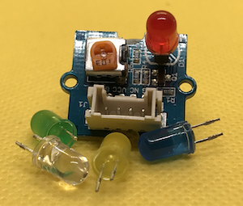

# Micro:bit - Grove Examples

## Introduction

This repository contains examplea Micropython programs demonstrating how to use various Grove components with the BBC Micro:bit microcontroller.

## Grove Components

The library covers the following Grove components

| Component                                                  |                                                           | SeeedStudio                                                                                                         | Example  |
| ---------------------------------------------------------- | --------------------------------------------------------- | ------------------------------------------------------------------------------------------------------------------- | -------- |
| OLED Display 0.66" (SSD1306)                               |                                                           | [Go Here](https://www.seeedstudio.com/Grove-OLED-Display-0-66-SSD1306-v1-0-p-5096.html)                             |          |
| OLED Yellow&Blue Display 0.96 (SSD1315)                    |                                                           | [Go Here](https://www.seeedstudio.com/Grove-OLED-Yellow-Blue-Display-0-96-SSD1315-V1-0-p-5010.html)                 |          | 
| Analog Microphone (MEMS)                                   |                                                           | [Go Here](https://www.seeedstudio.com/Grove-Analog-Microphone-p-4593.html)                                          |          |
| Ultrasonic Distance Sensor                                 |                                                           | [Go Here](https://www.seeedstudio.com/Grove-Ultrasonic-Distance-Sensor.html)                                        |          |
| Passive Buzzer                                             |                  | [Go Here](https://www.seeedstudio.com/Grove-Passive-Buzzer-p-4525.html)                                             | [Go Here](src/passive-buzzer.py)        |
| Piezo Buzzer/Active Buzzer                                 |                                                           | [Go Here](https://www.seeedstudio.com/Grove-Buzzer.html)                                                            |          |
| LED (Blue, Red, Green, White)                              |                                        | [Go Here](https://www.seeedstudio.com/Grove-LED-Pack-p-4364.html)                                                   | [Go Here](src/led.py)                   |
| 3-Axis Digital Accelerometer(±1.5g)                        |                                                           | [Go Here](https://www.seeedstudio.com/Grove-3-Axis-Digital-Accelerometer-1-5g.html)                                 |          |
| Magnetic Switch                                            |                | [Go Here](https://www.seeedstudio.com/Grove-Magnetic-Switch.html)                                                   | [Go Here](src/magnetic-switch.py)       |
| Tilt Switch                                                |                        | [Go Here](https://www.seeedstudio.com/Grove-Tilt-Switch.html)                                                       | [Go Here](src/tilt-switch.py)           |
| Relay                                                      |                                    | [Go Here](https://www.seeedstudio.com/Grove-Relay.html)                                                             | [Go Here](src/relay.py)                 |
| Water Sensor                                               |                                                           | [Go Here](https://www.seeedstudio.com/Grove-Water-Sensor.html)                                                      |          |
| Temperature Sensor                                         |                                                           | [Go Here](https://www.seeedstudio.com/Grove-Temperature-Sensor.html)                                                |          |
| Temperature & Humidity Sensor (High-Accuracy & Mini)       |                                                           | [Go Here](https://www.seeedstudio.com/Grove-Temperature-Humidity-Sensor-High-Accuracy-Mini.html)                    |          |
| AHT20 I2C Industrial Grade Temperature and Humidity Sensor |                                                           | [Go Here](https://www.seeedstudio.com/Grove-AHT20-I2C-Industrial-grade-temperature-and-humidity-sensor-p-4497.html) |          |
| Temperature & Humidity Sensor V2.0 (DHT20)                 |                                                           | [Go Here](https://www.seeedstudio.com/Grove-Temperature-Humidity-Sensor-V2-0-DHT20-p-4967.html)                     |          |
| Temperature & Humidity Sensor (DHT11)                      |                                                           | [Go Here](https://www.seeedstudio.com/Grove-Temperature-Humidity-Sensor-DHT11.html)                                 |          |
| Temperature & Humidity Sensor Pro (DHT22/AM2302)           |       | [Go Here](https://www.seeedstudio.com/Grove-Temperature-Humidity-Sensor-Pro-AM2302-DHT22.html)                      |          |
| Vibration Motor                                            |                | [Go Here](https://www.seeedstudio.com/Grove-Vibration-Motor.html)                                                   | [Go Here](src/vibration-motor.py)       |
| Thumb Joystick                                             |                                                           | [Go Here](https://www.seeedstudio.com/Grove-Thumb-Joystick.html)                                                    |          |
| Soil Moisture Sensor                                       |                                                           | [Go Here](https://www.seeedstudio.com/Grove-Moisture-Sensor.html)                                                   |          |
| Slide Potentiometer                                        |      | [Go Here](https://www.seeedstudio.com/Grove-Slide-Potentiometer.html)                                               | [Go Here](src/sliding_potentiometer.py) |
| Rotary Angle Sensor                                        |        | [Go Here](https://www.seeedstudio.com/Grove-Rotary-Angle-Sensor-P.html)                                             | [Go Here](src/rotary-angle-sensor.py)   |
| Encoder                                                    |                                | [Go Here](https://www.seeedstudio.com/Grove-Encoder.html)                                                           | [Go Here](src/encoder.py)             
| Sound Sensor/Noise Detector                                |                                                           | [Go Here](https://www.seeedstudio.com/Grove-Loudness-Sensor.html)                                                   |          |
| Speaker Plus                                               |                                                           | [Go Here](https://www.seeedstudio.com/Grove-Speaker-Plus-p-4592.html)                                               |          |
| Speaker                                                    |                                | [Go Here](https://www.seeedstudio.com/Grove-Speaker-p-1445.html)                                                    | [Go Here](src/speaker.py)               |
| Flame Sensor                                               |                                                           | [Go Here](https://www.seeedstudio.com/Grove-Flame-Sensor.html)                                                      |          |
| 4-Digit Display                                            |                                                           | [Go Here](https://www.seeedstudio.com/Grove-4-Digit-Display.html)                                                   |          |
| MOSFET                                                     |                                                           | [Go Here](https://www.seeedstudio.com/Grove-MOSFET.html)                                                            |          |
| Infrared Reflective Sensor v1.2                            |                                                           | [Go Here](https://www.seeedstudio.com/Grove-Infrared-Reflective-Sensor-v1-2.html)                                   |          |
| Light Sensor (P) v1.1                                      |                                                           | [Go Here](https://www.seeedstudio.com/Grove-Light-Sensor-P-v1-1.html)                                               |          |
| Temperature and Barometer Sensor                           |                                                           | [Go Here](https://www.seeedstudio.com/Grove-Barometer-Sensor-BMP280.html)                                           |          |
| LED Button (Red, Blue, Yellow)                             |                          | [Go Here](https://www.seeedstudio.com/Grove-Red-LED-Button.html)                                                    | [Go Here](src/dual-button.py)           |
| Variable Color LED V1.1                                    |          | [Go Here](https://www.seeedstudio.com/Grove-Variable-Color-LED-V1-1.html)                                           | [Go Here](src/variable-color-led.py)    |
| I2C Motor Driver (TB6612FNG)                               |                                                           | [Go Here](https://www.seeedstudio.com/Grove-I2C-Motor-Driver-TB6612FNG-p-3220.html)                                 |          |
| PIR Motion Sensor                                          |                                                           | [Go Here](https://www.seeedstudio.com/Grove-PIR-Motion-Sensor.html)                                                 |          |
| mini PIR motion sensor                                     |                                                           | [Go Here](https://www.seeedstudio.com/Grove-mini-PIR-motion-sensor-p-2930.html)                                     |          |
| Adjustable PIR Motion Sensor                               |                                                           | [Go Here](https://www.seeedstudio.com/Grove-Adjustable-PIR-Motion-Sensor.html)                                      |          |
| Dual Button                                                |                        | [Go Here](https://www.seeedstudio.com/Grove-Dual-Button-p-4529.html)                                                | [Go Here](src/dual-button.py)           |
| Button                                                     |                                  | [Go Here](https://www.seeedstudio.com/buttons-c-928/Grove-Button.html)                                              | [Go Here](src/button.py)                |
| Switch(P)                                                  |                              | [Go Here](https://www.seeedstudio.com/Grove-Switch-P.html)                                                          | [Go Here](src/switch-p.py)              |
| Purple LED (3mm)                                           |                                                           | [Go Here](https://www.seeedstudio.com/Grove-Purple-LED-3mm.html)                                                    |          |
| Light Sensor                                               |                                                           | [Go Here](https://www.seeedstudio.com/Grove-Light-Sensor-p-746.html)                                                |          |
| Touch Sensor                                               |                             | [Go Here](https://www.seeedstudio.com/Grove-Touch-Sensor.html)                                                      | [Go Here](src/touch.py)                 |
| Multi Color Flash LED                                      |    | [Go Here](https://www.seeedstudio.com/Grove-Multi-Color-Flash-LED-5mm.html)                                         | [Go Here](src/led.py)                   |
| 6 Poisition Dip Switch                                     |    | [Go Here](https://www.seeedstudio.com/Grove-6-Position-DIP-Switch.html)                                             | [Go Here](src/6-position-dip-switch.py) |
| Gesture                                                    |                                | [Go Here](https://wiki.seeedstudio.com/Grove-Gesture_v1.0/)                                                         |          |              
